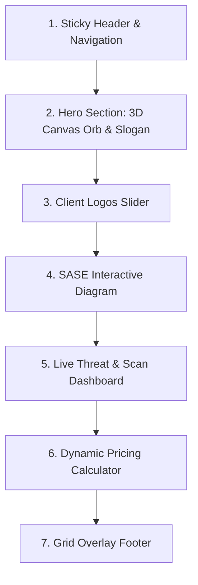

# FYNSEC Cybersecurity Landing Page Design Specification

이 문서는 Phenomenon Studio의 FYNSEC Dribbble 포트폴리오 디자인을 모티브로 하여 제작할 프리미엄 사이버 보안 기업 **FYNSEC**의 싱글 랜딩 페이지 프론트엔드 설계 사양서입니다.

---

## 1. 개요 및 목적
- **목적:** 최고 수준의 시각적 완성도(Premium Aesthetics)와 인터랙티브 기능을 제공하여 사용자에게 강렬한 인상을 심어주는 사이버 보안 기업 FYNSEC의 랜딩 페이지 구축.
- **디자인 철학:** 딱딱하고 위협적인 보안 이미지에서 탈피하여 '소프트 프로텍션(Soft Protection)'을 형상화한 유기적이고 미래지향적인 비주얼 중심의 연출.
- **구축 범위:** 단일 랜딩 페이지 프론트엔드 전체 (인터랙티브 기능 포함).

---

## 2. 디자인 시스템 및 비주얼 사양

### 2.1 색상 팔레트 (Color Palette)
- **Base Background:** Deep Dark HSL (240, 15%, 3%) / `#050508`
- **Card Background:** Glassmorphic Dark HSL (240, 10%, 6%) / `#0e0e12` (Opacity: 70%, Backdrop Blur: 12px)
- **Primary Accent & Glow:** Electric Cyan `#00f0ff` (Zero Trust & 안전 데이터 흐름 표시)
- **Secondary Accent & Glow:** Cyber Purple `#a855f7` (암호화 및 방화벽 표시)
- **Alert Colors:** 
  - Safe: Soft Green `#10b981`
  - Warning/Threat: Neon Crimson `#f43f5e`
- **Text Colors:**
  - Headings: Pure White `#ffffff` (Opacity: 100%)
  - Body: Soft Silver `#cbd5e1` (Opacity: 85%)
  - Muted: Dark Gray `#64748b`

### 2.2 타이포그래피 (Typography)
- **제목 (Headings):** `Outfit` (세련되고 하이테크적인 둥근 라운딩 구조의 산세리프 폰트)
- **본문 (Body & Mono):** `Inter` 및 `Geist Mono` (가독성과 데이터 정렬을 극대화하는 폰트)

### 2.3 UI 스타일 (UI Styling)
- **글래스모피즘 (Glassmorphism):** 모든 카드는 투명도 60-70%의 어두운 배경, 얇은 투명 테두리(`border: 1px solid rgba(255, 255, 255, 0.08)`), 강력한 흐림 효과(`backdrop-filter: blur(12px)`)를 적용.
- **네온 글로우 (Neon Glow):** 특정 호버 상태 및 핵심 위젯의 외곽선에 `box-shadow: 0 0 15px rgba(0, 240, 255, 0.3)` 형태의 광원 효과 부여.

---

## 3. 페이지 레이아웃 및 섹션 설계

### 3.1 Sticky Glass Header
- **네비게이션바:** `backdrop-filter: blur(16px)`와 `border-b`로 이루어진 고정 헤더.
- **로고:** FYNSEC 로고 마크 (마우스 호버 시 안쪽 원이 반응하여 미세하게 회전/글로우).
- **메뉴:** 서비스(Services), 솔루션(Solutions), 기능(Features), 요금제(Pricing). (각 메뉴 호버 시 하단에 일렉트릭 사이안 라인이 차오르는 마이크로 애니메이션).
- **CTA:** 우측에 'Book a Demo' 버튼 배치 (테두리 네온 글로우 순환 애니메이션).

### 3.2 Hero Section (3D Protection Orb)
- **핵심 비주얼:** HTML5 Canvas와 삼각함수 수학 공식을 활용해 제작하는 유기적으로 회전하고 파동치는 **3D 보안 구체(Soft Protection Orb)**. 마우스 커서의 움직임에 따라 구체를 이루는 노드들이 밀려나거나 끌어당겨지는 물리 반응 포함.
- **슬로건:** `"Elevating Enterprise Security Through Soft Protection"` - Outfit 폰트의 볼드 텍스트 적용.
- **서브텍스트:** `"클라우드 네이티브 SASE 솔루션과 Zero Trust 인프라를 통해 엔터프라이즈급 보안 장벽을 부드럽고 완벽하게 구축합니다."`
- **액션 버튼:** '보안 무료 진단' (네온 사이안 배경) 및 '작동 데모 보기' (투명 보더) 듀얼 버튼.

### 3.3 Client Logos Slider (무한 루프 마키)
- **협력사:** Stripe, Google, Microsoft, Vercel, Datadog 등 글로벌 기술 기업 로고 5종.
- **효과:** 어두운 톤의 회색조(Grayscale) 상태로 무한 롤링 슬라이드되며, 마우스 호버 시 원래 브랜드 고유 색상 또는 네온 컬러로 서서히 변환.

### 3.4 SASE 아키텍처 인터랙티브 다이어그램
- **모듈:** Zero Trust (ZTNA), Firewall-as-a-Service (FWaaS), CASB, Secure Web Gateway (SWG).
- **인터랙션:** 
  1. 사용자가 다이어그램 중앙의 특정 보안 레이어(예: ZTNA)를 클릭.
  2. 좌측 '사용자 단말기'에서 우측 '클라우드 어플리케이션'으로 통하는 데이터 패킷(네온 파티클)이 해당 모듈을 통과하며 색상이 변하고(보안 암호화), 보호막 장벽이 생성되는 시각 효과 재생.
  3. 클릭한 모듈의 기술 사양 및 기능 설명이 글래스 카드로 좌측 또는 하단에 부드럽게 등장.

### 3.5 실시간 위협 관제 대시보드 시뮬레이터 (Vulnerability Scanner)
- **비주얼:** 다크 대시보드 화면.
- **기능 컴포넌트:**
  1. **보안 지수 다이얼 (Security Score Gauge):** `85`에서 취약점 스캔 시 `98`로 상승하는 애니메이션 게이지.
  2. **실시간 위협 로그 (Live Audit Terminal):** `Geist Mono` 폰트로 실시간 패킷 검사, IP 감지, 포트 차단 로그가 콘솔 화면처럼 아래서 위로 스크롤되며 추가되는 위젯.
  3. **위협 감지 팝업 (Incident Alerts):** 위협이 감지되면 화면 우측 상단에 네온 Crimson 경고 토스트 팝업이 부드러운 트랜지션과 함께 생겨났다가 3초 후 사라짐.

### 3.6 맞춤형 서비스 계산기 (Pricing & Package Builder)
- **요소:** 
  - 사용자 수 슬라이더 (10명 ~ 5,000명).
  - 필수 보안 모듈 체크박스 (Zero Trust Access, FWaaS, Cloud Sandbox, 24/7 Monitoring).
- **작동:** 슬라이더 이동 및 체크박스 활성화에 따라 우측 카드의 **월 예상 비용(Estimated Monthly Price)** 수치가 카운트업 애니메이션과 함께 실시간 계산되어 변화.
- **최종 Action:** '맞춤 견적서 다운로드' 버튼 클릭 시 성공 알림 토스트 출력.

### 3.7 Grid Overlay Footer
- **디자인:** 격자무늬(Grid)와 은은하게 깜빡이는 도트 파티클이 오버레이된 백그라운드 적용.
- **구성:** 이메일 뉴스레터 가입 폼, 컴플라이언스 배지(ISO 27001, SOC2), 링크 그룹 및 저작권 정보 표시.

---

## 4. 기술 스택 및 구현 세부 사항
- **프레임워크:** React 18 (TypeScript)
- **스타일링:** Tailwind CSS 3.x
- **아이콘:** `lucide-react`
- **애니메이션:** CSS Keyframes & Tailwind Transition 효과 중심 (부드럽고 빠른 프레임 레이트 유지)
- **그래픽:** HTML5 Canvas (3D 수학적 공간 연산 노드 렌더링)
- **구조 설계:** 컴포넌트 단위 분할 (구체 컴포넌트, 다이어그램 컴포넌트, 대시보드 컴포넌트, 요금제 컴포넌트)로 가독성 및 유지보수성 극대화.

---

## 5. 승인 및 품질 기준 (Success Criteria)
1. **첫인상 (First-sight Wow factor):** 히어로 구체 애니메이션의 프레임 저하 없이 아름다운 흐름 연출.
2. **반응형 최적화 (Responsive Design):** 모바일, 태블릿, 데스크톱 전 기기 크기에서 글래스 카드 레이아웃과 그리드가 깨지지 않고 미려하게 배율 조정.
3. **인터랙션 완료도:** 다이어그램 모듈 클릭, 대시보드 스캔 시작, 가격 계산기 조절 등 모든 마우스 액션이 실시간 반응.
